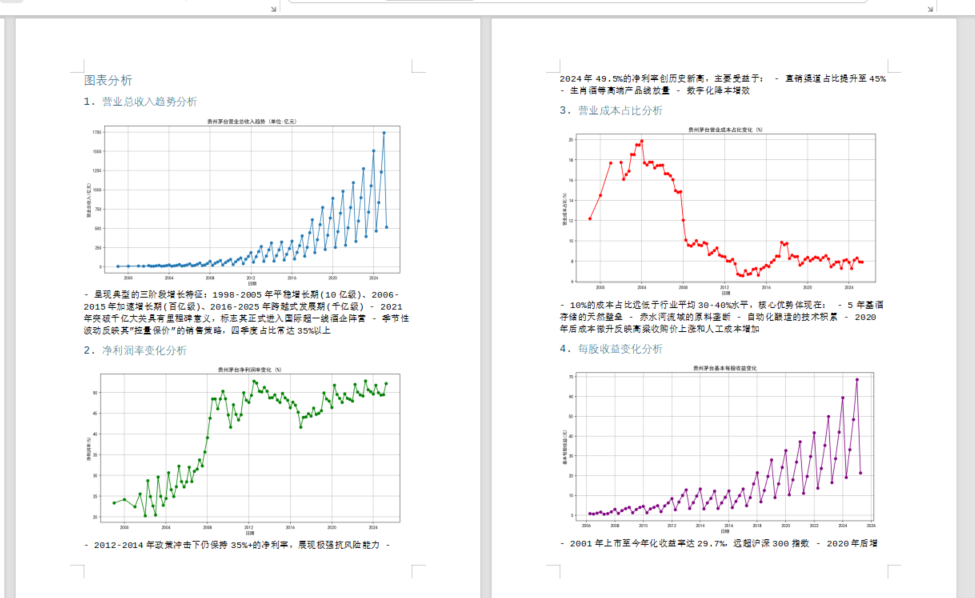
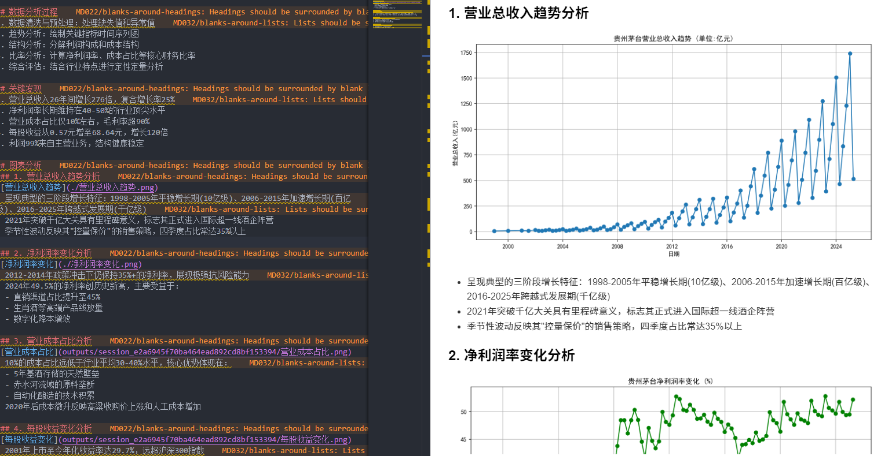

# 数据分析智能体 (Data Analysis Agent)

🤖 **基于LLM的智能数据分析代理**

[](https://python.org)
[](LICENSE)
[](https://openai.com)

## 📋 项目简介



数据分析智能体是一个功能强大的Python工具，它结合了大语言模型(LLM)的理解能力和Python数据分析库的计算能力，能够：

- 🎯 **自然语言分析**：接受用户的自然语言需求，自动生成专业的数据分析代码
- 📊 **智能可视化**：自动生成高质量的图表，支持中文显示，输出到专用目录
- 🔄 **迭代优化**：基于执行结果自动调整分析策略，持续优化分析质量
- 📝 **报告生成**：自动生成包含图表和分析结论的专业报告(Markdown + Word)
- 🛡️ **安全执行**：在受限的环境中安全执行代码，支持常用的数据分析库

## 🏗️ 项目架构

```
data_analysis_agent/
├── 📁 config/                 # 配置管理
│   ├── __init__.py
│   └── llm_config.py          # LLM配置(API密钥、模型等)
├── 📁 utils/                  # 核心工具模块
│   ├── code_executor.py       # 安全的代码执行器
│   ├── llm_helper.py          # LLM调用辅助类
│   ├── fallback_openai_client.py  # 支持故障转移的OpenAI客户端
│   ├── extract_code.py        # 代码提取工具
│   ├── format_execution_result.py  # 执行结果格式化
│   └── create_session_dir.py  # 会话目录管理
├── 📄 data_analysis_agent.py  # 主智能体类
├── 📄 prompts.py              # 系统提示词模板
├── 📄 main.py                 # 使用示例
├── 📄 requirements.txt        # 项目依赖
├── 📄 .env                    # 环境变量配置
└── 📁 outputs/                # 分析结果输出目录
    └── session_[UUID]/        # 每次分析的独立会话目录
        ├── *.png             # 生成的图表
        ├── 最终分析报告.md    # Markdown报告
        └── 最终分析报告.docx  # Word报告
```

## 📊 数据分析流程图

使用Mermaid图表展示完整的数据分析流程：

```mermaid
graph TD
    A[用户输入自然语言需求] --> B[初始化智能体]
    B --> C[创建专用会话目录]
    C --> D[LLM理解需求并生成代码]
    D --> E[安全代码执行器执行]
    E --> F{执行是否成功?}
    F -->|失败| G[错误分析与修复]
    G --> D
    F -->|成功| H[结果格式化与存储]
    H --> I{是否需要更多分析?}
    I -->|是| J[基于当前结果继续分析]
    J --> D
    I -->|否| K[收集所有图表]
    K --> L[生成最终分析报告]
    L --> M[输出Markdown和Word报告]
    M --> N[分析完成]

    style A fill:#e1f5fe
    style N fill:#c8e6c9
    style F fill:#fff3e0
    style I fill:#fff3e0
```

## 🔄 智能体工作流程

```mermaid
sequenceDiagram
    participant User as 用户
    participant Agent as 数据分析智能体
    participant LLM as 语言模型
    participant Executor as 代码执行器
    participant Storage as 文件存储

    User->>Agent: 提供数据文件和分析需求
    Agent->>Storage: 创建专用会话目录
    
    loop 多轮分析循环
        Agent->>LLM: 发送分析需求和上下文
        LLM->>Agent: 返回分析代码和推理
        Agent->>Executor: 执行Python代码
        Executor->>Storage: 保存图表文件
        Executor->>Agent: 返回执行结果
        
        alt 需要继续分析
            Agent->>LLM: 基于结果继续分析
        else 分析完成
            Agent->>LLM: 生成最终报告
            LLM->>Agent: 返回分析报告
            Agent->>Storage: 保存报告文件
        end
    end
    
    Agent->>User: 返回完整分析结果
```

## ✨ 核心特性

### 🧠 智能分析流程

- **多阶段分析**：数据探索 → 清洗检查 → 分析可视化 → 图片收集 → 报告生成
- **错误自愈**：自动检测并修复常见错误（编码、列名、数据类型等）
- **上下文保持**：Notebook环境中变量和状态在分析过程中持续保持

### 📋 多格式报告

- **Markdown报告**：结构化的分析报告，包含图表引用
- **Word文档**：专业的文档格式，便于分享和打印
- **图片集成**：报告中自动引用生成的图表

## 🚀 快速开始

### 1. 环境准备

```bash
# 克隆项目
git clone  https://github.com/li-xiu-qi/data_analysis_agent.git

cd data_analysis_agent

# 安装依赖
pip install -r requirements.txt
```

### 2. 配置API密钥

创建`.env`文件：

```bash
# OpenAI API配置
OPENAI_API_KEY=your_api_key_here
OPENAI_BASE_URL=https://api.openai.com/v1
OPENAI_MODEL=gpt-4

# 或者使用兼容的API（如火山引擎）
# OPENAI_BASE_URL=https://ark.cn-beijing.volces.com/api/v3
# OPENAI_MODEL=deepseek-v3-250324
```

### 3. 基本使用

```python
from data_analysis_agent import DataAnalysisAgent
from config.llm_config import LLMConfig

# 初始化智能体
llm_config = LLMConfig()
agent = DataAnalysisAgent(llm_config)

# 开始分析
files = ["your_data.csv"]
report = agent.analyze(
    user_input="分析销售数据，生成趋势图表和关键指标",
    files=files
)

print(report)
```

```python
# 自定义配置
agent = DataAnalysisAgent(
    llm_config=llm_config,
    output_dir="custom_outputs",  # 自定义输出目录
    max_rounds=30                 # 增加最大分析轮数
)

# 使用便捷函数
from data_analysis_agent import quick_analysis

report = quick_analysis(
    query="分析用户行为数据，重点关注转化率",
    files=["user_behavior.csv"],
    max_rounds=15
)
```

## 📊 使用示例

以下是分析贵州茅台财务数据的完整示例：

```python
# 示例：茅台财务分析
files = ["贵州茅台利润表.csv"]
report = agent.analyze(
    user_input="基于贵州茅台的数据，输出五个重要的统计指标，并绘制相关图表。最后生成汇报给我。",
    files=files
)
```

**生成的分析内容包括：**

- 📈 营业总收入趋势图
- 💰 净利润率变化分析
- 📊 利润构成分析图表
- 💵 每股收益变化趋势
- 📋 营业成本占比分析
- 📄 综合分析报告

## 🎨 Mermaid流程可视化

项目支持使用Mermaid语法生成各种流程图，帮助理解和展示数据分析过程：

### 📊 分析过程状态图

```mermaid
stateDiagram-v2
    [*] --> 数据加载
    数据加载 --> 数据探索: 成功加载
    数据加载 --> 编码修复: 编码错误
    编码修复 --> 数据探索: 修复完成
    
    数据探索 --> 数据清洗: 探索完成
    数据清洗 --> 统计分析: 清洗完成
    统计分析 --> 可视化生成: 分析完成
    
    可视化生成 --> 图表保存: 图表生成
    图表保存 --> 结果评估: 保存完成
    
    结果评估 --> 继续分析: 需要更多分析
    结果评估 --> 报告生成: 分析充分
    继续分析 --> 统计分析
    
    报告生成 --> [*]: 完成
```

### 🔄 错误处理流程

```mermaid
graph LR
    A[代码执行] --> B{是否出错?}
    B -->|否| C[执行成功]
    B -->|是| D[错误分析]
    D --> E{错误类型}
    E -->|编码错误| F[尝试不同编码]
    E -->|列名错误| G[检查实际列名]
    E -->|数据类型错误| H[类型转换]
    E -->|其他错误| I[生成修复代码]
    F --> A
    G --> A
    H --> A
    I --> A
    C --> J[继续下一步]
```

### 📈 数据流向图

```mermaid
flowchart TD
    subgraph Input [输入层]
        CSV[CSV文件]
        Query[用户查询]
    end
    
    subgraph Processing [处理层]
        Load[数据加载]
        Clean[数据清洗]
        Analyze[统计分析]
        Visualize[可视化]
    end
    
    subgraph AI [AI层]
        LLM[语言模型]
        CodeGen[代码生成]
        ErrorFix[错误修复]
    end
    
    subgraph Output [输出层]
        Charts[图表文件]
        Report[分析报告]
        Word[Word文档]
    end
    
    CSV --> Load
    Query --> LLM
    LLM --> CodeGen
    CodeGen --> Load
    Load --> Clean
    Clean --> Analyze
    Analyze --> Visualize
    Visualize --> Charts
    
    Load -.-> ErrorFix
    Clean -.-> ErrorFix
    Analyze -.-> ErrorFix
    Visualize -.-> ErrorFix
    ErrorFix --> CodeGen
    
    Charts --> Report
    Report --> Word
```

### 🛠️ 核心组件关系图

```mermaid
classDiagram
    class DataAnalysisAgent {
        +LLMConfig config
        +CodeExecutor executor
        +LLMHelper llm
        +analyze(user_input, files)
        +_process_round(prompt)
        +_handle_generate_code()
        +_handle_collect_figures()
    }
    
    class LLMHelper {
        +AsyncFallbackOpenAIClient client
        +call(prompt)
        +async_call(prompt)
        +parse_yaml_response(response)
    }
    
    class CodeExecutor {
        +InteractiveShell shell
        +execute_code(code)
        +_check_code_safety(code)
        +get_current_figures_info()
        +_setup_chinese_font()
    }
    
    class LLMConfig {
        +str api_key
        +str base_url
        +str model
        +int max_tokens
        +float temperature
    }
    
    DataAnalysisAgent --> LLMHelper
    DataAnalysisAgent --> CodeExecutor
    DataAnalysisAgent --> LLMConfig
    LLMHelper --> LLMConfig
```

### 📝 如何在报告中使用Mermaid

在生成的分析报告中，您可以添加Mermaid图表来展示：

1. **数据处理流程**：展示从原始数据到最终结果的转换过程
2. **决策树**：展示分析中的关键决策点
3. **时间线**：展示数据的时间维度变化
4. **关系图**：展示不同数据指标之间的关系

**示例：在分析报告中嵌入流程图**

```markdown
## 数据处理流程

本次分析遵循以下数据处理流程：

```mermaid
graph TD
    A[贵州茅台利润表.csv] --> B[数据加载与编码检测]
    B --> C[数据探索与结构分析]
    C --> D[财务指标计算]
    D --> E[趋势分析与可视化]
    E --> F[生成分析报告]
```

通过这个流程，我们确保了分析的系统性和完整性。

```

## 🔧 配置选项

### LLM配置

```python
@dataclass
class LLMConfig:
    provider: str = "openai"
    api_key: str = os.environ.get("OPENAI_API_KEY", "")
    base_url: str = os.environ.get("OPENAI_BASE_URL", "https://api.openai.com/v1")
    model: str = os.environ.get("OPENAI_MODEL", "gpt-4")
    max_tokens: int = 4000
    temperature: float = 0.1
```

### 执行器配置

```python
# 允许的库列表
ALLOWED_IMPORTS = {
    'pandas', 'numpy', 'matplotlib', 'duckdb', 
    'scipy', 'sklearn', 'plotly', 'requests',
    'os', 'json', 'datetime', 're', 'pathlib'
}
```

## 🎯 最佳实践

### 1. 数据准备

- ✅ 使用CSV格式，支持UTF-8/GBK编码
- ✅ 确保列名清晰、无特殊字符
- ✅ 数据量适中（建议<100MB）

### 2. 查询编写

- ✅ 使用清晰的中文描述分析需求
- ✅ 指定想要的图表类型和关键指标
- ✅ 明确分析的目标和重点

### 3. 结果解读

- ✅ 检查生成的图表是否符合预期
- ✅ 阅读分析报告中的关键发现
- ✅ 根据需要调整查询重新分析

## 🚨 注意事项

### 安全限制

- 🔒 仅支持预定义的数据分析库
- 🔒 不允许文件系统操作（除图片保存）
- 🔒 不支持网络请求（除LLM调用）

### 性能考虑

- ⚡ 大数据集可能导致分析时间较长
- ⚡ 复杂分析任务可能需要多轮交互
- ⚡ API调用频率受到模型限制

### 兼容性

- 🐍 Python 3.8+
- 📊 支持pandas兼容的数据格式
- 🖼️ 需要matplotlib中文字体支持

## 🐛 故障排除

### 常见问题

**Q: 图表中文显示为方框？**
A: 确保系统安装了SimHei字体，或在代码中指定其他中文字体。

**Q: API调用失败？**
A: 检查`.env`文件中的API密钥和端点配置，确保网络连接正常。

**Q: 数据加载错误？**
A: 检查文件路径和编码格式，支持UTF-8、GBK等常见编码。

**Q: 分析结果不准确？**
A: 尝试提供更详细的分析需求，或检查原始数据质量。

**Q: Mermaid流程图无法正常显示？**
A: 确保在支持Mermaid的环境中查看（如GitHub、Typora、VS Code预览等）。如果在本地查看，推荐使用支持Mermaid的Markdown编辑器。

**Q: 如何自定义流程图样式？**
A: 可以在Mermaid代码块中添加样式定义，或使用不同的图表类型（graph、flowchart、sequenceDiagram等）来满足不同的展示需求。

### 错误日志

分析过程中的错误信息会保存在会话目录中，便于调试和优化。

## 🤝 贡献指南

欢迎贡献代码和改进建议！

1. Fork 项目
2. 创建功能分支
3. 提交更改
4. 推送到分支
5. 创建Pull Request

## 📄 许可证

本项目基于MIT许可证开源。详见[LICENSE](LICENSE)文件。

## 🔄 更新日志

### v1.0.0

- ✨ 初始版本发布
- 🎯 支持自然语言数据分析
- 📊 集成matplotlib图表生成
- 📝 自动报告生成功能
- 🔒 安全的代码执行环境

---

<div align="center">

**🚀 让数据分析变得更智能、更简单！**

</div>
